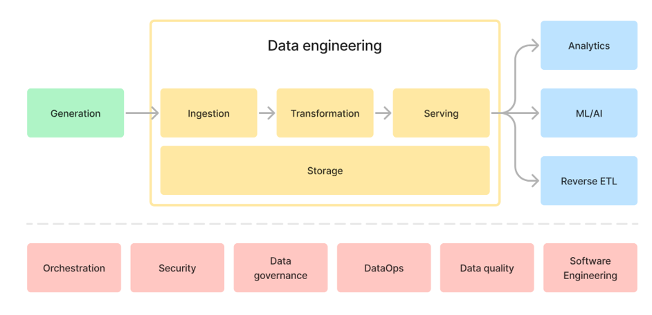
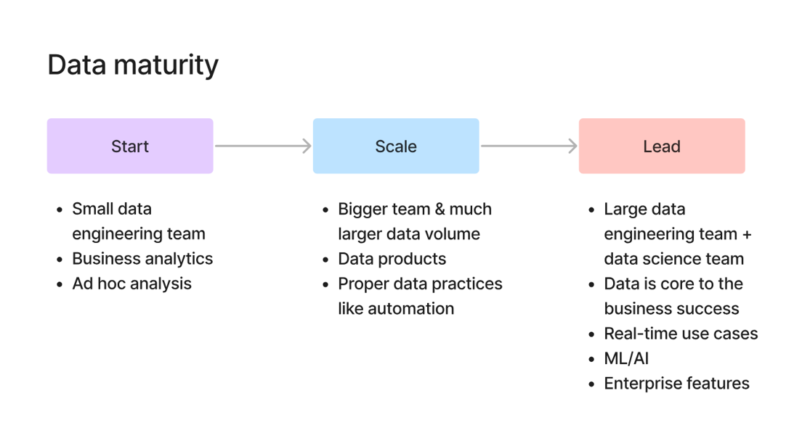

# Introduction to Data Engineering

- We can easily understand data engineering in the context of data pipeline. First think data as a flow. It is generated somewhere and changed somewhere and served to someone who is going to use this data to do something useful. Lets understand this in a meaningful way with an example.

- Consider an ecommerce website such as amazon. Whenever you order something in amazon then an order data is generated from it. And this data gets manipulated and served to financial analyst to analyze this data and derive some useful insights for an organization.

- Since we thought data as a flow, the upstream in this flow is data generation. In this case it is amazon ecommerce website which we called as data producers. Downstream in this case is financial analyst which we call as data consumers. The person who brigdes the gap between data producers and data consumers is called as data engineer.

- So we can think data engineering as a bridge between data producers and data consumers. In simple words, data engineering is about turing the raw data collected from the data producers into clean, reliable and accessible data for decision making for data consumers.

- In professional way, Data Engineering is practice of building scalable, reliable systems which transforms raw data into high quality data for analytics and machine learning. or technically we can say it as Data Engineering is a discipline of designing, buliding and maintaining systems for collecting, storing, processing and analyzing the data at scale.

- Generally we might get a question that why do we need a seperate role for extracting, loading and transforming the data in an organization. The better way of answering to this the growth of technology. As the technology is growing rapidly, new apps, websites, payment gateways and new devices such as IOT sensor and autonomous cars getting developed which is generating massive amount of data. Since data is generating rapidly, organization wants to use this data to derive meaningful insights from it to improve orgainzation business which means businees use cases are also increasing. So organization need a person who can build an efficient system which can extract, load and transform the data in an appropriate format required by the business use case. The person who can build those kind of systems are called data engineers.

## Data Engineering Pipeline

- Data Engineering Pipeline actually divided into two main parts. First one is actual data engineering pipeline and second one is undercurrents which we can see in the below image.

  

  
   
  <em>Data Engineering Pipeline</em>
  

- Data Engineering Pipeline starts with Data Generation where actual data gets generated. It could be order data from ecommerece website, events data from IOT devices such as CCTV etc or data generated from censors of Autonomous vehicles. 

- Once the data gets generated, here comes the actual data engineering part. After data generation, we need to recieve the data through API's and store it somewhere. This process of recieving and storing the data is called as Ingestion. This Ingestion process might be difficult if we have different sources of data. For example, a typical ecommerce company gets data from different sources. It gets order data from ecommerce website, payment data from payment gateways like stripe etc, events data from the website, sales data from the salesforce etc. It is difficult to collect all this using different API's.

- Once we collected all these data then we have to store this data. We have different types of storages systems such as MYSQL, Postgres for relational data storage and Amazon S3 for object storage etc. 

- Once we stored the raw data, now the next step we have to do is transform this data. Since we get data from different sources, we have to transform this data into one format, so that it could be esily used by the data consumers.

- Once we transform the data into meaningful format, then we need to serve this data to data consumers who might use this data for analytics, AI or ML or reverse ETL usecase.

- The common thing we do in this entire pipeline is storing the data in all the stages. I mean we store raw data and tranformed data also which we need for future purposes.

- Second part of the data pipeline is undercurrents which spans entire data pipeline. They are Orchestation, Security, Data governance and DataOps, Data Quality etc.

## History of Data Engineering

### 1. 1980 - 2000: Data Warehouse Era 

- In 1980's businesses began realizing that their growing piles of operational data from sales to inventory logs held valuable insights. But this data was scattered among various departments, systems and formats. They doesn't have centralized storage which stores all thier operational data.

- This given the birth to Data warehouses. Data Warehouses are centralized systems which stores structured data which is clean, well organized and queryable. To feed these data warehouses a new role gets emerged which is ETL developer. These ETL developers will develop data pipelines which extracts, transforms, stores the data into warehouses. Since the data stored in warehouse is well structured, now the organization need a person who can analyze the data and generate reports by using well structured data. Here a new role gets emerged which is business Intelligence Engineers whi actually analyzes the data and generate reports.

- But these systems are rigid and expensive. Everything was On-premises which means comapanies had to buy and manage thier own hardware such as servers. And ETL developers also needs to change thier pipleines when data gets changed (as business is expanding new formats of data is getting generated). So this mechanism is becoming more complex and expensive for the organization.

### 2. 2000 - 2010: Big Data Engineering Era

- In early 2000's world has changed and internet evoleved rapidly. Now huge amount of data is getting generated which businesses cannot able to handle. Amount of data generating is one concern for them and anothor one is data isn't structured anymore. It is in the form of images, log and clickstreams etc.

- Traditional Data warehouse cannot able to handle these variety, velocity and volume of these data.In these time Big Data Evolution kicked off.

- In 2003, Google produced a research paper on MapReduce which process large datasets accross multiple machines. This inspired the creation of Apache Hadoop which is an open source ecosystem for big data. Now instead of centralized monoliths, data could be stored and processed accross clusters of cheap commidity software.

- With these new challenges and tools, new roles are emerged at that time which are Big Data Engineers. They masterd tools like Hadoop, Hive and pig to get into the new roles. Later Apache Spark offered faster, in-memory processing and kafka enabled real-time streaming of events. 

- Eventhough these technologies solved many complex problems such as Hadoop prodived Distributed storage by HDFS file system and parallel processing by Map Reduce to handle large data which cannot be done by molithic datawarehouse and spark solved Hadoops Map Reduce by introducing in memory computation instead of disk computation and kafka is used for real time data pipelines, they become old as time progressing.

- Because they are hard to manage such as complex setup and configuration, cluster management (YARN, Zookeeper), Manual scaling and high operational overload. And we need to more professionals who understands underlying technology behind these ecosystems. So by seeing these challenges, companies realized that they were spending more time and money for managing the software than working with data.

### 3. 2020 - Present: Modern Data Engineering Era

- By the time of 2020's, each organization started maintaining their own infrastructure, os they started shifting towards cloud. Instead of managing you own Hadoop cluster, you could use Snowflake or Big Query, cloud-native data warehouses that scaled data automatically. Instead of writing custom ingestion scripts, we can use tools like Fivetarn to pipe data from dozons of sources effortlessly. Instead of ETL, the world shifts towards ELT: load raw data first, then transform it later using tools like dbt etc.

- This changed the roles in data teams. Data Engineers were no longer just plumbers of pipelines as they become platform builders and automation specialists. And the focus also shifted from `how can we process the data ?` to `how we do we enable fast reliable insights for business ?`

## Data Maturity

- Data Maturity measures how effectively an organization collects, manages, analyzes, and uses its data to drive decisions and automation. Simply, it is the measurement of how well an organization manages and analyzes its data assests.

- Consider an example of Shopsmart startup company which pickups the orders and sell products to the companies. At start they usually check how many orders they got in last week ? etc. They might have a small team to manage all these operations. So there might be only one person who analyzes the data. Since they don't have huge volume of customers, so they store all the data in a monolithic DB. If they want to find how many orders they have got in last week, then they will fetch the data from that monolithic DB and generates charts using Excel. So here they are not using their data effectively as their main concentration is on to get more customers and manufacturing products. So at this stage they doesn't value the data and they doesn't have that much data to get something out out of it. So at this stage the data maturity is in "Start" state.

- As days go on, Shopsmart starts getting more orders because of quality of thier product etc. Now they getting huge volume of data which needs to be handled and analyzed effectively. So they starts hiring a data engineer and data analyst to handle the data effectively and generate dynamic dashboards for managing their inventory and operations etc. At this stage the data maturity is at "Scale" state.

- After long time, Shopsmart evolved as big ecommerce company and now its need to give tough competition to its competitors in order to survive in the market and reach the expectations of the customers. So they decided to build a recommender system for recommending products to customers and gives the real time experiance such as personalized discounts and product shipping tracker etc. For this they need a data science team along with data engineer. At this stage the data maturity level is "Lead" state.

- So we can see that as data maturity level increases with the increase of data volume then the tech stack and employees required also increases.

  

  
   
  <em>Data Engineering Pipeline</em>
  

## Data Engineers place with in a data team

- As we know Data is a Flow, then data engineers are brigde between data produces and data consumers. Here data producers are software engineers and devops engineers. Becuase software engineers are the one who actually builds the applications and from that applications only majority of data gets generated. On the otherside, devops engineers are responsible for maintaining infrastructure of the application in cloud or on premises. From them we might get the log data and event data. So data engineers need to coordinate with them effectively to know about how much volume of data it would be generated etc and based on it only they might decide which tech stack they have to use in order build the data pipeline.

- In downstream, we have data consumer such as Data Analysts and Data Scientists. Data Engineers needs to coordinate with these people also as they have to know in which format and what type of data they actually need so they can decide which transformation they needs to apply to the data so that they can transform data to the appropriate format required by data scietists and data analysts.

- The main resposnibilites of data engineers are :

  1. They need to communicate both technical and non technical people. 
  2. They need to understand how to scope and manage a data project.
  3. They need to minimize the cost and work within the budget.
  4. They need to create a good data architecture.
  5. They need to build and manage a reliable and performant data pipelines.
  6. They need to make sure the security of data and need to follow the general data protection rules (GDPR) and use good dataops practices.
